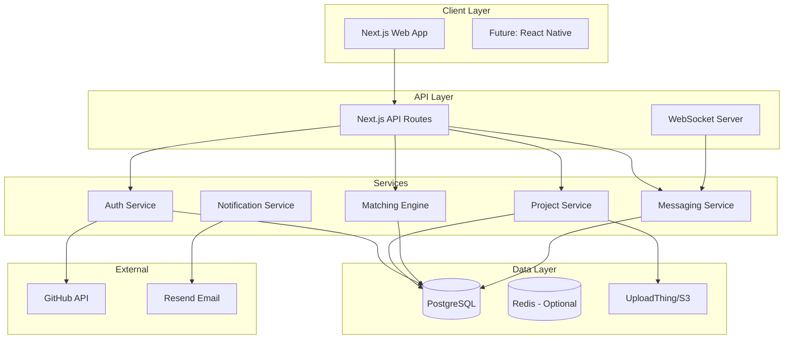
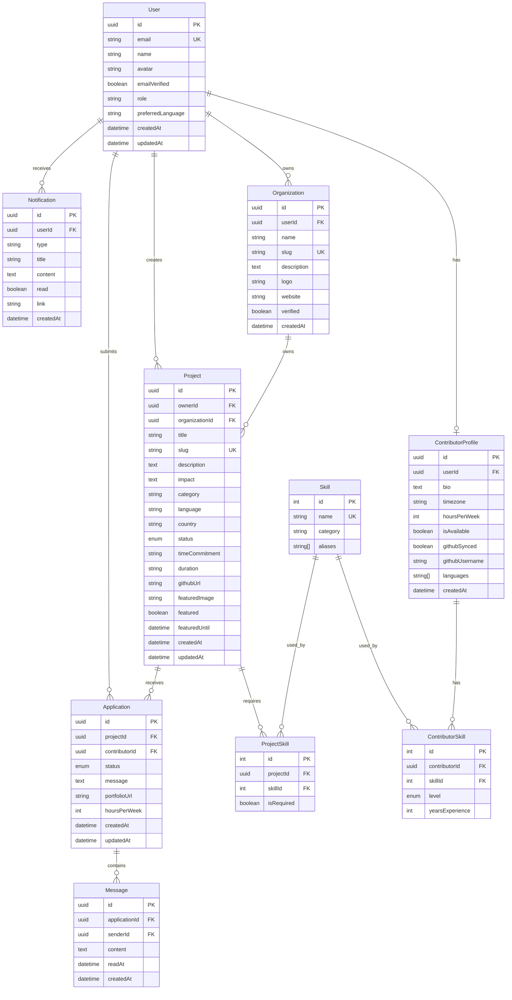
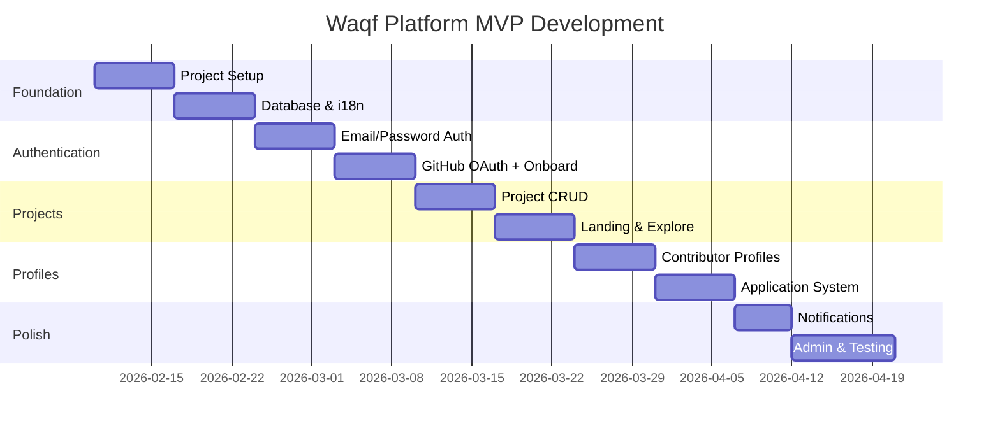

# Waqf Platform - Comprehensive Execution Plan

> **Platform Name**: Waqf (وقف) — Connecting Muslim developers with impactful open-source Islamic projects  
> **Document Version**: 1.0  
> **Created**: February 7, 2026

---

## Table of Contents
1. [Executive Summary](#1-executive-summary)
2. [Tech Stack Recommendation](#2-tech-stack-recommendation)
3. [Architecture Overview](#3-architecture-overview)
4. [Database Strategy](#4-database-strategy)
5. [Phased Implementation Plan](#5-phased-implementation-plan)
6. [Timeline & Milestones](#6-timeline--milestones)

---

## 1. Executive Summary

### Vision (PRD §1.1)
Waqf is a **bilingual Arabic-first platform** that connects volunteer developers with Islamic open-source projects. The platform embodies the Islamic concept of *waqf* (endowment/sadaqah jariyah) — continuous charity through code contributions.

### Core Value Proposition
| Stakeholder | Value |
|-------------|-------|
| **Developers** | Contribute skills as *sadaqah jariyah* — continuous charity through code |
| **Creators** | Build Islamic tech with support from the global Muslim developer community |
| **Ummah** | Accelerate development of ethical, open-source Islamic tools |

### Success Definition (PRD §1.3)
A successful match = Developer application is **accepted** by project owner, beginning their contribution as digital waqf.

---

## 2. Tech Stack Recommendation

### 2.1 Recommended Stack

Based on the PRD requirements (§7.1) and Figma design analysis, here is the optimized technology stack:

| Layer | Technology | Rationale |
|-------|------------|-----------|
| **Framework** | Next.js 14+ (App Router) | SSR/SSG for SEO, excellent i18n support, API routes built-in |
| **Language** | TypeScript | Type safety for complex user/project models |
| **Styling** | Tailwind CSS + shadcn/ui | RTL support, pre-built accessible components |
| **State (Client)** | Zustand | Lightweight, simple for mode switching (Waqif/Mutawalli) |
| **State (Server)** | TanStack Query | Caching, optimistic updates for application flow |
| **Database** | PostgreSQL | Full-text search, JSON support for skills taxonomy |
| **ORM** | Prisma | Type-safe queries, excellent DX, migration support |
| **Auth** | NextAuth.js v5 | GitHub OAuth + Credentials, session management |
| **File Uploads** | UploadThing | Simple S3-compatible uploads for avatars/logos |
| **Email** | Resend | Transactional emails, Arabic template support |
| **Search** | PostgreSQL Full-Text (MVP) → Algolia (v2) | Progressive enhancement |
| **Real-time** | Pusher or Socket.io | For messaging system |
| **Deployment** | Vercel + Neon/Supabase | Serverless-friendly, edge functions |

### 2.2 Why This Stack Fits Waqf

1. **Arabic-First & RTL Support**
   - Tailwind CSS has native RTL utilities (`rtl:`, `ltr:` prefixes)
   - shadcn/ui components are RTL-compatible (PRD §5.5)
   - Next.js `next-intl` provides robust i18n with Arabic support

2. **GitHub Integration** (PRD §6)
   - NextAuth.js has built-in GitHub OAuth provider
   - Easy access to GitHub API for contribution graphs

3. **Matching Algorithm** (PRD §3.5)
   - PostgreSQL supports complex queries for skill matching
   - Full-text search enables project discovery

4. **Community-Focused**
   - Open-source friendly stack
   - Low barrier to contributor onboarding

---

## 3. Architecture Overview

### 3.1 High-Level System Diagram



### 3.2 Core System Components

#### A. Authentication Module (PRD §3.2)

| Feature | Description |
|---------|-------------|
| **Methods** | Email/Password + GitHub OAuth |
| **Onboarding Paths** | Waqif (Contributor) / Mutawalli (Creator) |
| **Session** | JWT tokens with 30-day expiry |
| **Role Management** | User, Organization Owner, Admin |

**Key Flows**:
- Signup → Path Selection → Profile Setup → Dashboard
- GitHub OAuth → Auto-import profile/languages/repos

#### B. Project Listing Module (PRD §3.4)

| Feature | Description |
|---------|-------------|
| **CRUD** | Create, Read, Update projects |
| **Status Management** | Draft → Pending → Open → In Progress → Completed |
| **Admin Review** | Moderation queue for pending projects |
| **Featured System** | Admin-curated homepage showcase (max 6) |

**Categories** (PRD §3.1):
- Quran, Prayer, Charity, Education, Community, Tools

#### C. Contribution Tracking Module (PRD §3.6)

| Feature | Description |
|---------|-------------|
| **Applications** | Contributor applies to project with cover letter |
| **States** | Pending → Accepted/Rejected/Withdrawn |
| **Match Scoring** | Skill match (70%) + Category (15%) + Language (10%) + Recency (5%) |
| **History** | Waqf History on contributor profiles |

#### D. User Profiles Module (PRD §3.3)

| Profile Type | Key Fields |
|--------------|------------|
| **Contributor (Waqif)** | Bio, skills matrix, portfolio, GitHub stats, availability, waqf history |
| **Organization (Mutawalli)** | Name, logo, description, website, verified status |
| **Unified Account** | Single account can be both contributor and creator |

---

## 4. Database Strategy

### 4.1 Entity Relationship Diagram



### 4.2 Preliminary Schema Design (Prisma)

```prisma
// ============ ENUMS ============
enum UserRole {
  USER
  ADMIN
}

enum SkillLevel {
  BEGINNER
  INTERMEDIATE
  ADVANCED
  EXPERT
}

enum ProjectStatus {
  DRAFT
  PENDING
  OPEN
  IN_PROGRESS
  COMPLETED
  CANCELLED
}

enum ApplicationStatus {
  PENDING
  ACCEPTED
  REJECTED
  WITHDRAWN
}

enum ProjectCategory {
  QURAN
  PRAYER
  CHARITY
  EDUCATION
  COMMUNITY
  TOOLS
}

enum ProjectLanguage {
  ARABIC
  ENGLISH
  BOTH
}

// ============ MODELS ============

model User {
  id                   String               @id @default(cuid())
  email                String               @unique
  name                 String
  avatar               String?
  passwordHash         String?
  emailVerified        DateTime?
  role                 UserRole             @default(USER)
  preferredLanguage    String               @default("ar")
  contributorProfile   ContributorProfile?
  organizations        Organization[]
  projects             Project[]
  applications         Application[]
  sentMessages         Message[]
  notifications        Notification[]
  accounts             Account[]            // For NextAuth
  sessions             Session[]            // For NextAuth
  createdAt            DateTime             @default(now())
  updatedAt            DateTime             @updatedAt
}

model ContributorProfile {
  id                String             @id @default(cuid())
  userId            String             @unique
  user              User               @relation(fields: [userId], references: [id], onDelete: Cascade)
  bio               String?
  intentionStatement String?
  timezone          String?
  hoursPerWeek      Int?
  isAvailable       Boolean            @default(true)
  githubSynced      Boolean            @default(false)
  githubUsername    String?
  githubData        Json?              // Cached GitHub stats
  spokenLanguages   String[]           @default(["ar"])
  preferredCategories ProjectCategory[]
  skills            ContributorSkill[]
  portfolioItems    PortfolioItem[]
  createdAt         DateTime           @default(now())
  updatedAt         DateTime           @updatedAt
}

model Organization {
  id            String    @id @default(cuid())
  userId        String
  user          User      @relation(fields: [userId], references: [id], onDelete: Cascade)
  name          String
  slug          String    @unique
  description   String?
  logo          String?
  website       String?
  verified      Boolean   @default(false)
  projects      Project[]
  createdAt     DateTime  @default(now())
  updatedAt     DateTime  @updatedAt
}

model Skill {
  id                Int                @id @default(autoincrement())
  name              String             @unique
  nameAr            String?
  category          String
  aliases           String[]           @default([])
  contributorSkills ContributorSkill[]
  projectSkills     ProjectSkill[]
}

model ContributorSkill {
  id               Int        @id @default(autoincrement())
  contributorId    String
  contributor      ContributorProfile @relation(fields: [contributorId], references: [id], onDelete: Cascade)
  skillId          Int
  skill            Skill      @relation(fields: [skillId], references: [id])
  level            SkillLevel @default(BEGINNER)
  yearsExperience  Int?
  
  @@unique([contributorId, skillId])
}

model PortfolioItem {
  id               String             @id @default(cuid())
  contributorId    String
  contributor      ContributorProfile @relation(fields: [contributorId], references: [id], onDelete: Cascade)
  title            String
  description      String?
  url              String
  imageUrl         String?
  order            Int                @default(0)
  createdAt        DateTime           @default(now())
}

model Project {
  id               String          @id @default(cuid())
  ownerId          String
  owner            User            @relation(fields: [ownerId], references: [id])
  organizationId   String?
  organization     Organization?   @relation(fields: [organizationId], references: [id])
  title            String
  slug             String          @unique
  description      String
  impact           String?
  category         ProjectCategory
  language         ProjectLanguage
  country          String?
  status           ProjectStatus   @default(DRAFT)
  timeCommitment   String?
  duration         String?
  githubUrl        String?
  featuredImage    String?
  featured         Boolean         @default(false)
  featuredUntil    DateTime?
  skills           ProjectSkill[]
  applications     Application[]
  adminFeedback    String?
  viewCount        Int             @default(0)
  createdAt        DateTime        @default(now())
  updatedAt        DateTime        @updatedAt
  
  @@index([status, category])
  @@index([featured, featuredUntil])
}

model ProjectSkill {
  id           Int     @id @default(autoincrement())
  projectId    String
  project      Project @relation(fields: [projectId], references: [id], onDelete: Cascade)
  skillId      Int
  skill        Skill   @relation(fields: [skillId], references: [id])
  isRequired   Boolean @default(true)
  
  @@unique([projectId, skillId])
}

model Application {
  id               String            @id @default(cuid())
  projectId        String
  project          Project           @relation(fields: [projectId], references: [id])
  contributorId    String
  contributor      User              @relation(fields: [contributorId], references: [id])
  status           ApplicationStatus @default(PENDING)
  message          String?
  portfolioUrl     String?
  hoursPerWeek     Int?
  messages         Message[]
  createdAt        DateTime          @default(now())
  updatedAt        DateTime          @updatedAt
  
  @@unique([projectId, contributorId])
  @@index([status])
}

model Message {
  id              String      @id @default(cuid())
  applicationId   String
  application     Application @relation(fields: [applicationId], references: [id], onDelete: Cascade)
  senderId        String
  sender          User        @relation(fields: [senderId], references: [id])
  content         String
  readAt          DateTime?
  createdAt       DateTime    @default(now())
}

model Notification {
  id        String   @id @default(cuid())
  userId    String
  user      User     @relation(fields: [userId], references: [id], onDelete: Cascade)
  type      String
  title     String
  content   String?
  read      Boolean  @default(false)
  link      String?
  createdAt DateTime @default(now())
  
  @@index([userId, read])
}

// ============ NextAuth.js Models ============
model Account {
  id                String  @id @default(cuid())
  userId            String
  type              String
  provider          String
  providerAccountId String
  refresh_token     String?
  access_token      String?
  expires_at        Int?
  token_type        String?
  scope             String?
  id_token          String?
  session_state     String?
  user              User    @relation(fields: [userId], references: [id], onDelete: Cascade)
  
  @@unique([provider, providerAccountId])
}

model Session {
  id           String   @id @default(cuid())
  sessionToken String   @unique
  userId       String
  expires      DateTime
  user         User     @relation(fields: [userId], references: [id], onDelete: Cascade)
}
```

### 4.3 Waqf Impact Metrics (Special Consideration)

To track the "digital waqf" impact, we add computed/aggregated metrics:

| Metric | Source | Purpose |
|--------|--------|---------|
| **Waqf Hours** | Sum of (hoursPerWeek × weeks contributed) | Total volunteer hours |
| **Projects Impacted** | Count of accepted applications | Breadth of contribution |
| **Active Waqifs** | Users with ≥1 accepted application in 30 days | Community health |
| **Match Success Rate** | Accepted / Total applications | Platform efficiency |

**Implementation**: PostgreSQL materialized views or calculated at read-time.

---

## 5. Phased Implementation Plan

### 5.1 Phase 1: MVP (Core Features to Launch)

**Goal**: Enable users to discover projects and apply to contribute.  
**Duration**: 8-10 weeks

#### 5.1.1 Week 1-2: Foundation

| Task | Description | PRD Reference |
|------|-------------|---------------|
| **Project Setup** | Initialize Next.js 14 with TypeScript, Tailwind, shadcn/ui | §7.1 |
| **Database Setup** | PostgreSQL + Prisma schema, seed with skills taxonomy | §7.2 |
| **i18n Configuration** | next-intl setup, Arabic as default locale | §5 |
| **Design System** | Implement colors, typography (Inter + Noto Sans Arabic) | §8.1, Figma |
| **RTL Support** | Configure Tailwind RTL, test component mirroring | §5.5 |

**Deliverables**:
- Running Next.js app with `/ar` and `/en` routes
- Prisma migrations applied
- Base UI components (Button, Card, Input, etc.)

#### 5.1.2 Week 3-4: Authentication

| Task | Description | PRD Reference |
|------|-------------|---------------|
| **Email/Password Auth** | Registration, login, password reset | §3.2, §7.3 |
| **GitHub OAuth** | GitHub login with profile import | §6 |
| **Onboarding Flow** | Waqif/Mutawalli path selection | §3.2 |
| **Protected Routes** | Middleware for auth-required pages | — |

**Deliverables**:
- Complete signup/login flows
- GitHub OAuth working
- Session persistence

#### 5.1.3 Week 5-6: Project System

| Task | Description | PRD Reference |
|------|-------------|---------------|
| **Project CRUD** | Create, edit, view projects | §3.4 |
| **Project Statuses** | Draft → Pending → Open workflow | §3.4 |
| **Landing Page** | Hero, featured projects, categories | §3.1, Figma |
| **Explore Page** | Project grid with basic filters | §3.5, Figma |
| **Project Detail** | Full project view with "Contribute" CTA | §3.4, Figma |

**Deliverables**:
- Users can create and publish projects
- Landing page with static featured projects
- Explore page with category/status filters

#### 5.1.4 Week 7-8: Profiles & Applications

| Task | Description | PRD Reference |
|------|-------------|---------------|
| **Contributor Profile** | Public profile with skills matrix | §3.3, Figma |
| **Profile Editing** | Skills selector, portfolio management | §3.3 |
| **Application Flow** | Apply modal, application list views | §3.6 |
| **Application Management** | Accept/reject for project owners | §3.6 |

**Deliverables**:
- Complete contributor profiles
- Working application system
- Owner can manage applications

#### 5.1.5 Week 9-10: MVP Polish

| Task | Description | PRD Reference |
|------|-------------|---------------|
| **Notifications (Basic)** | In-app notification system | §3.8 |
| **Email Notifications** | Resend integration for key events | §3.8 |
| **Admin: Project Approval** | Basic moderation queue | §4.1 |
| **Responsive Testing** | Mobile layout verification | §8.2 |
| **Performance Audit** | Core Web Vitals optimization | — |

**Deliverables**:
- MVP ready for soft launch
- Admin can approve/reject projects
- Mobile-responsive across all pages

---

### 5.2 Phase 2: Growth (Community Features & Advanced Filtering)

**Goal**: Enhance discovery, add messaging, improve matching.  
**Duration**: 6-8 weeks (post-MVP launch)

#### 5.2.1 Enhanced Discovery

| Task | Description | PRD Reference |
|------|-------------|---------------|
| **Matching Algorithm** | Implement skill-based scoring | §3.5 (Phase 1 algo) |
| **Advanced Filters** | Time commitment, language, region | §3.5 |
| **Search** | PostgreSQL full-text search | §7.1 |
| **Sort Options** | Recommended, Newest, Most Active | §3.5 |
| **Featured Curation** | Admin tool for homepage features | §4.3 |

#### 5.2.2 Messaging System

| Task | Description | PRD Reference |
|------|-------------|---------------|
| **In-App Messaging** | Application-scoped conversations | §3.7 |
| **Real-time Updates** | WebSocket/Pusher integration | §3.7 |
| **Read Receipts** | Message status indicators | §3.7 |
| **Message Notifications** | Push/email for new messages | §3.8 |

#### 5.2.3 Community Features

| Task | Description | PRD Reference |
|------|-------------|---------------|
| **Waqf History** | Contribution timeline on profiles | §3.3 |
| **GitHub Stats Sync** | Auto-import contribution data | §6.2 |
| **Organization Profiles** | Full org pages with team projects | §2.1 |
| **Project Verification** | Verified badge for orgs | §3.4 |

#### 5.2.4 Admin Dashboard

| Task | Description | PRD Reference |
|------|-------------|---------------|
| **Analytics Dashboard** | Key metrics visualization | §4.2 |
| **User Moderation** | Ban/suspend functionality | §4.1 |
| **Content Reporting** | Report flow for projects/users | §4.1 |
| **Bulk Actions** | Trusted creator fast-track | §4.1 |

---

### 5.3 Feature Matrix Summary

| Feature | Phase 1 (MVP) | Phase 2 (Growth) |
|---------|:-------------:|:----------------:|
| Landing Page | ✅ | Enhanced |
| Auth (Email) | ✅ | — |
| Auth (GitHub) | ✅ | — |
| Onboarding Flow | ✅ | — |
| Project CRUD | ✅ | — |
| Explore (Basic Filters) | ✅ | Advanced |
| Contributor Profiles | ✅ | GitHub Sync |
| Applications | ✅ | — |
| Basic Notifications | ✅ | Push + Real-time |
| Admin Approval | ✅ | Full Dashboard |
| Messaging | ❌ | ✅ |
| Matching Algorithm | ❌ | ✅ |
| Full-text Search | ❌ | ✅ |
| Analytics | ❌ | ✅ |
| RTL/Arabic | ✅ | — |

---

## 6. Timeline & Milestones

### 6.1 Phase 1 Timeline (10 Weeks)



### 6.2 Key Milestones

| Milestone | Target Date | Deliverable |
|-----------|-------------|-------------|
| **Foundation Complete** | Week 2 | Running app with auth scaffold |
| **Auth Complete** | Week 4 | Users can sign up/login |
| **Projects Complete** | Week 6 | Full project lifecycle |
| **MVP Feature Complete** | Week 8 | All core features working |
| **MVP Launch Ready** | Week 10 | Tested, polished, deployed |
| **Phase 2 Complete** | +8 weeks | Community features live |

### 6.3 Risk Mitigation

| Risk | Mitigation |
|------|------------|
| **RTL/i18n complexity** | Test early with Arabic content, use proven libraries |
| **GitHub API rate limits** | Implement caching, background sync |
| **Matching algorithm tuning** | Start simple, iterate based on data |
| **Scope creep** | Strict MVP feature set, defer "nice-to-haves" |

---

## 7. References to Source Documents

| Document | Key Sections Referenced |
|----------|------------------------|
| [PRD.md](file:///c:/Users/saleh/Desktop/Waqf-Platform/context/PRD.md) | §1-9 (Full specification) |
| [Navigation Guide](file:///c:/Users/saleh/Desktop/Waqf-Platform/Plans/Waqf%20Platform%20Figma/src/NAVIGATION_GUIDE.md) | Page structure, routing patterns |
| [Figma Components](file:///c:/Users/saleh/Desktop/Waqf-Platform/Plans/Waqf%20Platform%20Figma/src/components) | LandingPage, ExplorePage, ProfilePage, ProjectDetailPage |

---

## 8. Next Steps

1. **Review & Approve** this execution plan
2. **Environment Setup** — Initialize repository structure
3. **Begin Phase 1, Week 1** — Project scaffolding and database setup
4. **Define Sprint Cadence** — 1-week sprints recommended for MVP

---

> *"Whoever guides someone to goodness will have a reward like one who did it."*  
> — Prophet Muhammad ﷺ (Sahih Muslim)
